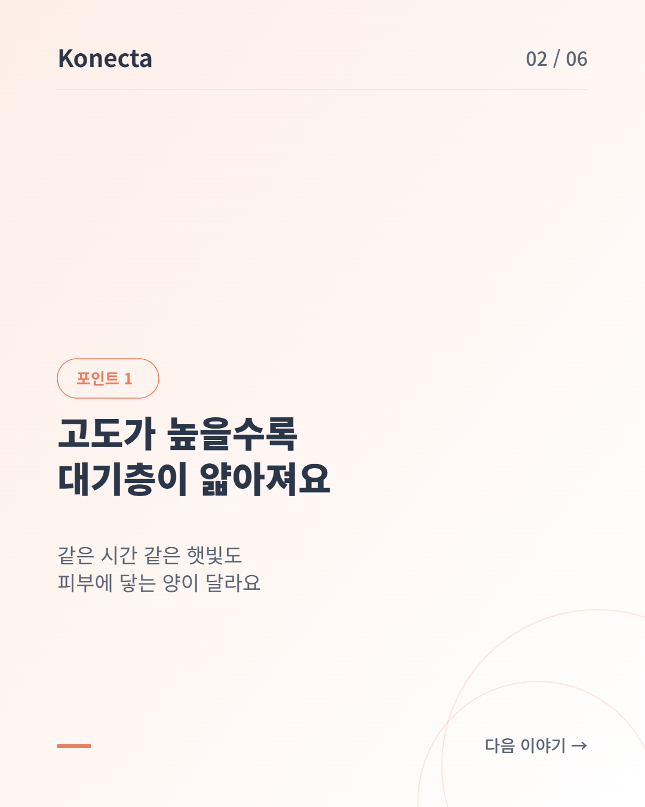
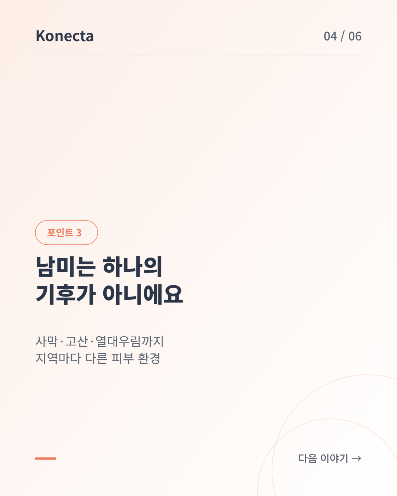
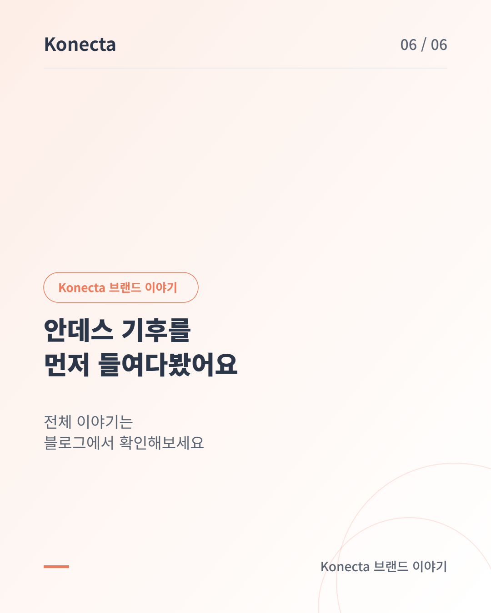

# 2026-09-22 홈페이지 블로그 — 고산 지대의 햇빛은 다르다, 선케어부터 챙겨야 하는 이유

- 노션 페이지: https://app.notion.com/p/3e36f13048af819fa8fed5eb556ecf07
- 디자인 미리보기(아티팩트): https://claude.ai/artifact/P6LPfPnzwRDuexv9ZoyLms
- 발행일: 2026-09-22 / 카테고리: 루틴 / 슬러그: andes-uv-suncare-first / 필라: 제품소개

## 요약

안데스 고산지대의 자외선이 유독 강한 이유와, 그래서 선케어를 가장 먼저 챙겨야 하는 이유를 정리했습니다.

## 카드뉴스 이미지 (PNG, 6슬라이드)

Notion "홈페이지 블로그" 페이지 하단에도 동일 카드뉴스가 SVG로 첨부되어 있습니다.

## 상태

- 노션 "발행" 체크박스를 켜서 Cloudflare Pages 빌드 시 실제 `/blog` 페이지에 반영되도록 함
- 이 커밋을 `main`에 푸시해 Cloudflare Pages 재배포를 트리거함
- SNS(인스타그램 등) 실제 게시는 아직 자동화되어 있지 않음 — 이 저장소 안에 실제 게시 API 연동(Meta Graph API 등)이 없어 초안(카드뉴스·릴스 대본)만 준비되고, 게시는 사용자가 직접 진행해야 함
